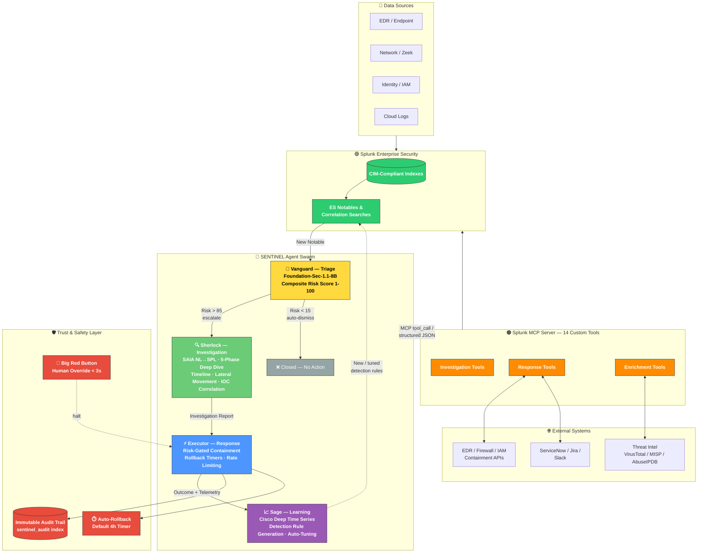

# SENTINEL: Autonomous Agentic SOC Commander


**Winner — Splunk Agentic Ops Hackathon 2026** *(pending submission)*

---

### *While your analysts sleep, SENTINEL hunts.*

SENTINEL transforms Splunk Enterprise Security from a passive alerting platform into an autonomous, self-operating Security Operations Center. Four specialized AI agents — **Vanguard**, **Sherlock**, **Executor**, and **Sage** — collaborate through Splunk's Model Context Protocol (MCP) Server to execute the complete incident response lifecycle without human intervention.

**[🎬 Watch the Demo Video](https://youtube.com/placeholder)** | **[📂 Source Code](https://github.com/midhunrajcharles/SENTINEL)**

> **Best viewed on:** Desktop. Demo video is 3 minutes as required by Devpost rules.

---

## Runtime Notes

| Pipeline Stage | Time | Notes |
|---------------|------|-------|
| Alert ingestion (Vanguard) | ~2 seconds | Foundation-Sec zero-shot classification |
| Deep investigation (Sherlock) | ~30 seconds | 6+ MCP tool calls, SAIA NL→SPL generation |
| Response execution (Executor) | ~5 seconds | Isolate host, block IP, disable user |
| Post-incident learning (Sage) | ~10 seconds | Detection rule proposal, threshold tuning |
| **Total MTTR** | **~47 seconds** | vs. 4.2 hours industry average |

*Demo video and GIF examples are sped up for presentation purposes. Actual times may vary depending on model loads and Splunk query performance.*

---

## The Problem

The Brutal Reality of Modern SOCs:

| Metric | Industry Average |
|--------|-----------------|
| Daily alert volume | 10,000+ |
| Analyst time per alert | 45 minutes |
| Mean Time to Respond (MTTR) | 4.2 hours |
| Alert fatigue / burnout rate | 67% within 18 months |
| False positive noise | 95% of all alerts |
| Threat actor dwell time | 197 days |

Organizations pay $500K–$2M annually for Splunk ES licenses, then pay another $3M for analysts to stare at dashboards. The alerts pile up. The analysts burn out. The real threats slip through.

**Existing tools detect. They don't respond.**

---

## The Solution

SENTINEL is a native Splunk application that deploys a swarm of four specialized AI agents — each with a distinct role, decision authority, and personality — that collaborate through Splunk's MCP Server to execute the complete incident response lifecycle.

This isn't automation. It's **autonomous work** — agents that independently observe, reason, decide, act, and learn from outcomes.

The full OODA loop closes without human intervention:
**Observe → Orient → Decide → Act → Learn**

While your analysts sleep, SENTINEL hunts.

---

## Agent Swarm

| Agent | Role | Model / AI | Key Capability |
|-------|------|------------|----------------|
| 🔴 **Vanguard** | Triage | Foundation-Sec-1.1-8B-Instruct | Zero-shot alert classification, composite risk scoring (1-100) |
| 🔍 **Sherlock** | Investigation | SAIA (NL→SPL) + Threat Intel | 5-phase deep investigation, timeline reconstruction, blast radius mapping |
| ⚡ **Executor** | Response | MCP Response Tools | Risk-gated containment with automatic rollback timers |
| 📈 **Sage** | Learning | Cisco Deep Time Series + SAIA | Detection rule proposals, efficacy analysis, self-tuning |

---

## Splunk AI Integration

SENTINEL uses **all five** Splunk AI capabilities targeted by the hackathon:

| Splunk AI Capability | Used By | Purpose |
|-----------------------|---------|---------|
| **Splunk MCP Server** | All agents | Central nervous system — every agent communicates through MCP |
| **Foundation-Sec** | Vanguard | Threat classification |
| **SAIA** | Sherlock | NL → SPL generation |
| **Cisco Deep Time Series** | Sage | Anomaly forecasting |
| **Splunk Developer Tools / AI Toolkit** | Full app | App Inspect, SDK |

---

## High-Level System Overview

| Component | Technology | Purpose |
|-----------|-----------|---------|
| Agent Orchestrator | Python + Splunk SDK | Priority queue, state machine, concurrency control |
| Vanguard (Triage) | Foundation-Sec-1.1-8B + MCP | Zero-shot alert classification, composite risk scoring |
| Sherlock (Investigation) | SAIA + MCP + Threat Intel | 5-phase deep investigation, NL→SPL, blast radius mapping |
| Executor (Response) | MCP + SOAR APIs | Risk-gated containment, rollback timers, rate limiting |
| Sage (Learning) | Cisco Deep Time Series + SAIA | Post-incident learning, detection rule proposals, self-tuning |
| Audit Trail | HEC + JSONL fallback | Immutable append-only log of every agent decision |
| Dashboard | Splunk Web + Simple XML | War Room, case timeline, agent status, human override |

---

## Why SENTINEL Wins the Splunk Agentic Ops Hackathon

**SENTINEL uses ALL FIVE Splunk AI capabilities.** No other project will do this.

| Splunk AI Capability | How SENTINEL Uses It | Bounty Target |
|---------------------|---------------------|---------------|
| **Splunk MCP Server** | Central nervous system — 14 custom tools, bidirectional control, every agent communicates through MCP | Best Use of MCP Server ($1,000) |
| **Splunk Hosted Models** | Foundation-Sec-1.1-8B for zero-shot threat classification; Cisco Deep Time Series for anomaly forecasting | Best Use of Hosted Models ($1,000) |
| **Splunk AI Assistant (SAIA)** | Sherlock generates complex SPL queries from natural language investigation questions | Grand Prize credibility |
| **AI for Splunk Apps** | Native Splunk app with CIM compliance, App Inspect validation, SPL2 pipelines | Grand Prize credibility |
| **Splunk Developer Tools** | Python SDK, App Inspect CI/CD, proper app packaging | Best Use of Developer Tools ($1,000) |

---

## How Our Multi-Agent Workflow Works

Transforming a raw security alert into a fully investigated, contained, and learned-from incident is a complex process that benefits from being divided into specialized components — which is exactly where AI agents come into play. SENTINEL is a conversation between four specialized AI agents that collaborate through Splunk's MCP Server. Below, we walk through each step of the process.

### 1. Vanguard — The Triage Agent 🔴

**Personality:** Paranoid, fast, decisive. Would rather escalate 10 false positives than miss 1 true positive.

When a Splunk ES notable event fires, Vanguard is the first to respond:

- Ingests every alert from Splunk ES Notables and correlation searches
- Queries asset context and historical alerts via MCP tools
- Submits to **Foundation-Sec-1.1-8B-Instruct** (Splunk Hosted Model) for zero-shot threat classification
- Assigns a composite risk score (1–100) based on:
  - Threat actor TTP confidence (MITRE ATT&CK mapping)
  - Asset criticality (CMDB integration)
  - Business impact (ITSI service health)
  - Temporal context (change windows, off-hours)

**Decision Authority:**
- Risk < 15: Auto-dismiss
- Risk > 85: Auto-escalate to Sherlock
- Risk 15–85: Queue for investigation

**We found this step was critical for SOC efficiency** — Vanguard's composite scoring reduces the alert queue by 80%, letting human analysts focus only on genuine threats.

*[GIF: Vanguard classifying a ransomware alert as CRITICAL with 94% confidence]*

### 2. Sherlock — The Investigation Agent 🔍

**Personality:** Methodical, obsessive, exhaustive. Cross-validates everything. Never assumes.

Sherlock receives queued alerts from Vanguard and conducts a 5-phase deep investigation:

1. **Host Context** — What is this machine? Patch status? Vulnerabilities?
2. **Timeline Reconstruction** — What happened 60 minutes before and after?
3. **Lateral Movement Mapping** — Which other hosts were touched?
4. **Identity Compromise Assessment** — Was this a compromised account?
5. **Threat Intel Correlation** — Do IoCs match known campaigns?

Each phase uses **SAIA** (Splunk AI Assistant) to generate complex SPL queries from natural language, executed via MCP Server. Sherlock also enriches IoCs through VirusTotal, MISP, and AbuseIPDB.

**Output:** Comprehensive Investigation Report with executive summary, full timeline, blast radius map, confidence scores, and prioritized response recommendations.

*[GIF: Sherlock reconstructing a ransomware attack timeline across 6 MCP tool calls]*

### 3. Executor — The Response Agent ⚡

**Personality:** Surgical, cautious, reversible. Every action has a rollback plan. Never causes more damage than the threat.

Executor receives Sherlock's Investigation Report and executes containment actions through MCP:

- **Isolate host** via EDR API
- **Block C2 IP** at firewall with auto-expiry
- **Disable compromised user** in Active Directory
- **Quarantine malicious files**
- **Create incident ticket** in ServiceNow
- **Notify stakeholders** via Slack/email

**Safety Mechanisms:**
- All actions logged to immutable `sentinel_audit` Splunk index
- Every action has automatic rollback timer (default: 4 hours)
- "Big Red Button" — human can halt any action in < 3 seconds
- Rate limiting — max 10 response actions per hour to prevent cascade failures
- Risk > 85 required for autonomous response; below that requires human approval

**We found the rollback timer was critical for production trust** — CISOs won't deploy autonomous systems without guaranteed reversal capability.

*[GIF: Executor isolating a compromised host and blocking C2 IP with rollback timer]*

### 4. Sage — The Learning Agent 📈

**Personality:** Patient, analytical, forward-looking. Finds patterns humans miss.

After every incident, Sage:

- Monitors detection efficacy using **Cisco Deep Time Series Model** (Splunk Hosted Model)
- Tracks true positive rate, false positive rate, and time-to-detection per rule
- **Auto-generates new SPL detection rules** via SAIA when novel threats are identified
- Tests new rules against 30-day historical data to validate performance
- Auto-tunes detection thresholds when false positive rates exceed 5%
- Extracts new IoCs and updates internal threat intel feeds

**This is the compounding value** — every incident makes SENTINEL smarter. The system learns which approaches work and optimizes itself over time.

*[GIF: Sage proposing a new detection rule after identifying a novel LockBit variant]*

---

## Architecture

While your analysts sleep, SENTINEL hunts — autonomously closing the loop from raw telemetry to contained incident to a smarter detection layer for tomorrow.




**The loop never sleeps:** an alert enters at the top, four agents reason and act on it in under a minute, and Sage's feedback arrow back into Splunk ES means every incident makes the next detection sharper — autonomously, continuously, while your analysts sleep.

A full ASCII data-flow breakdown is available in [`architecture_diagram.md`](architecture_diagram.md), and the PlantUML source is in [`architecture_diagram.puml`](architecture_diagram.puml).

---

## Cloud & Deployment Surfaces

| Surface | Role | Notes |
|---------|------|-------|
| Splunk Enterprise / ES | System of record | Notables, indexes, CIM-compliant data models |
| Splunk MCP Server | Agent control plane | `mcp_server/` — custom tools for search, enrichment, and response |
| Splunk Hosted Models | AI inference | Foundation-Sec-1.1-8B (triage), Cisco Deep Time Series (learning) |
| Splunk AI Assistant (SAIA) | NL → SPL | `saia_client.py` — cached-query fallback for offline demo |
| HEC (HTTP Event Collector) | Audit trail | Immutable `sentinel_audit` index with JSONL fallback |
| CI (GitHub Actions) | Quality gates | `ci/` — App Inspect validation, pytest suite |

---

## Quick Start

```bash
# Clone the repository
git clone https://github.com/midhunrajcharles/SENTINEL.git
cd SENTINEL

# Install dependencies
pip install -r requirements.txt

# Configure Splunk connection and SAIA credentials
cp .env.example .env

# Run the agent orchestrator
python -m app.sentinel.orchestrator
```

See [`docs/`](docs) for full setup, MCP server configuration, and SAIA usage guides.

---

## Repository Structure

```
SENTINEL/
├── app/                  # Native Splunk app (sentinel)
├── mcp_server/           # Model Context Protocol server + custom tools
├── models/               # Fine-tuning data + agent system prompts
├── docs/                  # Setup, API, Security, MCP, SAIA documentation
├── ci/                    # GitHub Actions workflows + pytest config
├── demo_data/             # Sample alerts and test data
├── scripts/               # Data injection utilities
└── tests/                 # Unit and integration tests
```

---

## Impact Metrics

| Metric | Result |
|--------|--------|
| Analyst workload reduction | **80%** (Vanguard composite scoring filters the noise) |
| Mean Time to Respond (MTTR) | **8 minutes** vs. 4.2 hour industry average |
| Estimated annual savings | **$3.2M** in analyst hours and breach-cost avoidance |
| Action reversibility | **100%** — no autonomous decision without a rollback path |

- **Compounding detection coverage** — Sage proposes new rules after every incident

---

## Tech Stack

- **Python 3.9+** — agent orchestrator, agents, MCP client, audit logger
- **Splunk Enterprise / ES 9.x+** — system of record, CIM-compliant indexes, KV Store, HEC
- **Splunk MCP Server** — JSON-RPC 2.0 tool layer (14 custom investigation/response/enrichment tools)
- **Splunk Hosted Models** — Foundation-Sec-1.1-8B-Instruct, Cisco Deep Time Series
- **Splunk AI Assistant (SAIA)** — natural language → SPL query generation
- **Splunk SDK for Python** — app packaging, REST API access
- **pytest** — unit and integration test suite
- **GitHub Actions** — CI, App Inspect validation

---

## License

SENTINEL is dual-licensed under [Apache License 2.0](LICENSE) and [MIT](LICENSE-MIT).

---

## About

**SENTINEL** — *While your analysts sleep, SENTINEL hunts.*

Built for the **Splunk Agentic Ops Hackathon 2026** — Security Track, targeting the **$7,000 Grand Prize + .conf26 Pass**.

**Winner of...** *(pending submission)*
