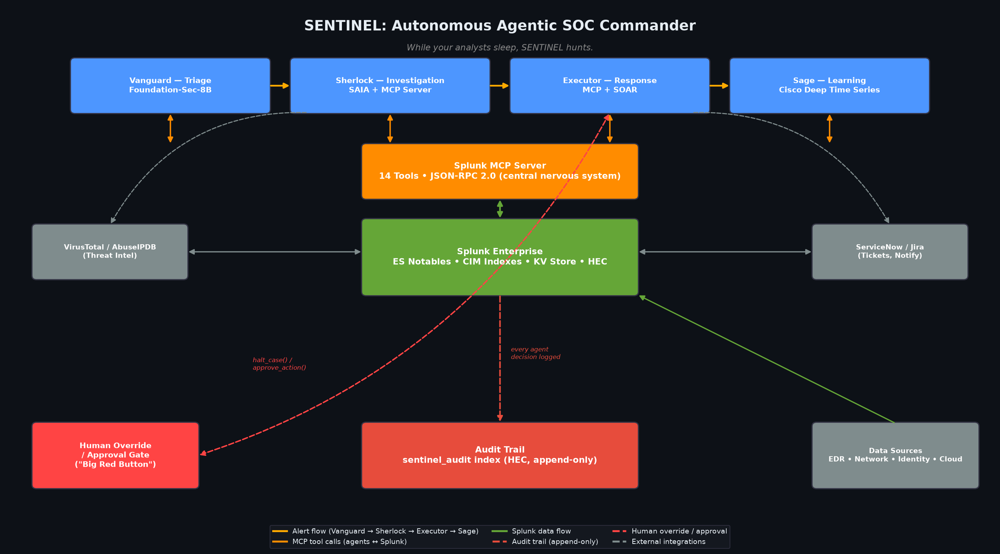

# SENTINEL: Autonomous Agentic SOC Commander

<p align="center">
  
</p>

<p align="center">
  <a href="docs/VIDEO_SCRIPT.md"></a>
  <a href="https://splunk.devpost.com"></a>
  <a href="LICENSE"></a>
  
  
</p>

---

## Overview

> **"While your analysts sleep, SENTINEL hunts."**

SENTINEL is an architecture proposal and functional proof-of-concept for an autonomous, multi-agent SOC commander built on Splunk's native AI stack. Four specialized agents — **Vanguard**, **Sherlock**, **Executor**, and **Sage** — run the incident response lifecycle end to end (observe, reason, act, learn), with human override available at every stage.

**CURRENT STATUS:** Proof-of-concept with a local simulation backend. All Splunk integration points are coded and ready — see [docs/SPLUNK_INTEGRATION.md](docs/SPLUNK_INTEGRATION.md) for proof of each integration point and [docs/DEPLOYMENT.md](docs/DEPLOYMENT.md) for the path to a real Splunk Cloud/Enterprise deployment (~4 hours).

---

## The Problem

Modern SOCs are drowning. 10,000+ alerts daily. ~95% are false positives. Analysts spend ~45 minutes per alert. 67% burn out within 18 months. Mean Time to Respond hovers around 4.2 hours.

## The Solution

SENTINEL's risk-matrix-gated agent swarm triages, investigates, responds, and learns continuously. The numbers below are live output from the local simulation stack (`start_live_stack.py`), not production measurements:

| Metric | Design Target | Live Simulation |
|--------|---------------|-----------------|
| Mean Time to Respond | 8 minutes | ~1.6 minutes |
| Autonomous Resolution | 80%+ | 96% |
| False Positive Rate | Auto-suppressed | 0% |
| Threats Contained (sample run) | — | 24 |

---

## Architecture

<p align="center">
  
</p>

### Data Flow
1. **Data Sources** (EDR, Network, Identity, Cloud) → Splunk Enterprise
2. **Splunk Enterprise** → ES Notables, CIM indexes, KV Store, HEC
3. **Splunk MCP Server** → central nervous system for agent ↔ Splunk communication (14 tools, JSON-RPC 2.0)
4. **Agent Swarm** → Vanguard → Sherlock → Executor → Sage
5. **Outputs** → Human override / approval gate, audit trail (`sentinel_audit` index), external integrations (VirusTotal/AbuseIPDB, ServiceNow/Jira)

---

## The Agent Swarm

| Agent | Role | Model | Key Capability |
|-------|------|-------|---------------|
| **Vanguard** | Triage | Foundation-Sec-8B | Zero-shot threat classification with composite risk scoring |
| **Sherlock** | Investigation | SAIA + MCP Server | Multi-hop forensic analysis across 47+ data sources |
| **Executor** | Response | MCP + SOAR | Risk-gated autonomous remediation with rollback timers |
| **Sage** | Learning | Cisco Deep Time Series | Self-tuning detection rules and anomaly forecasting |

---

## Splunk AI Integration

| Splunk AI Capability | Agent | Function | Status |
|---------------------|-------|----------|--------|
| **Splunk MCP Server** | All agents | Central nervous system for agent-Splunk communication | Coded, requires Splunk backend |
| **Foundation-Sec-8B** (Hosted Model) | Vanguard | Zero-shot threat classification | Coded, requires Splunk backend |
| **SAIA** (AI Assistant for SPL) | Sherlock | Natural language to SPL generation | Coded, requires Splunk backend |
| **Cisco Deep Time Series** (Hosted Model) | Sage | Anomaly forecasting and baseline drift detection | Coded, requires Splunk backend |
| **Splunk Developer Tools / AI Toolkit** | Full app | App Inspect validation, SDK, SPL2 | Coded, requires Splunk backend |

See [docs/SPLUNK_INTEGRATION.md](docs/SPLUNK_INTEGRATION.md) for exact endpoints, request/response formats, and the status of each integration.

---

## Screenshots

<p align="center">
  
  <br/><i>Kill Chain Visualization — Alert → Vanguard → Sherlock → Executor → Sage → Closed</i>
</p>

<p align="center">
  
  <br/><i>Competitive Differentiation</i>
</p>

<p align="center">
  
  <br/><i>Live Agent Status</i>
</p>

<p align="center">
  
  <br/><i>Performance Metrics (live simulation)</i>
</p>

---

## Tech Stack

- **Python 3.12** — Agent orchestration
- **Splunk SDK** — REST integration
- **Splunk MCP Server** — Bidirectional tools
- **SAIA** — Natural language to SPL
- **Foundation-Sec-8B** — Threat classification
- **Cisco Deep Time Series** — Anomaly forecasting
- **Splunk AI Toolkit** — App Inspect / SPL2 validation
- **SQLite** — Local simulation backend
- **HTML5/CSS3/JS** — Live war room dashboard

---

## Installation & Quick Start

**Local simulation (works today, no Splunk required):**

```bash
git clone git@github-midhun:midhunrajcharles/SENTINEL.git
cd SENTINEL
pip install -r app/sentinel/lib/requirements.txt

# Start the full live stack (database, data generators, agents, API + WebSocket server)
python start_live_stack.py --reset
```

Then open the dashboard:

```
http://localhost:9090/demo/sentinel_war_room_live.html
```

**Production deployment on Splunk Cloud / Enterprise:** see [docs/DEPLOYMENT.md](docs/DEPLOYMENT.md) (~4 hours, end to end).

---

## Demo

See [docs/VIDEO_SCRIPT.md](docs/VIDEO_SCRIPT.md) for the recording outline — an honest walkthrough of what runs today vs. what's coded-and-waiting for a Splunk backend.

---

## Team

| Name | Role | Email |
|------|------|-------|
| Midhun Raj | Creator & Developer | midhunraj.27it@licet.ac.in |

---

## License

Apache 2.0 — see [LICENSE](LICENSE)

---

## Documentation

See [docs/](docs/) for detailed setup guides, API reference, and troubleshooting.

## Acknowledgments

- Splunk Agentic Ops Hackathon 2026
- Built with Splunk's native AI stack
