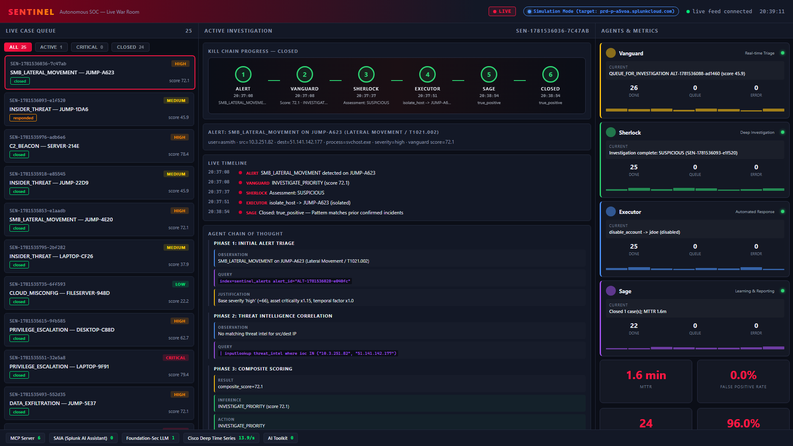
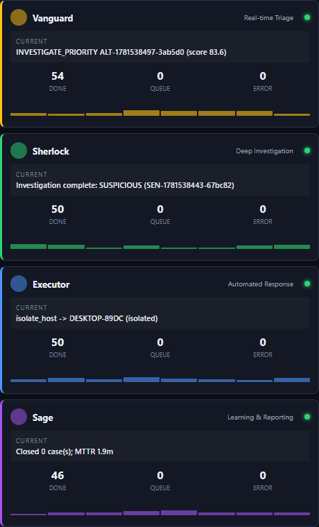
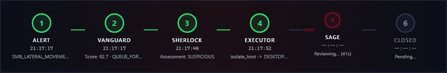
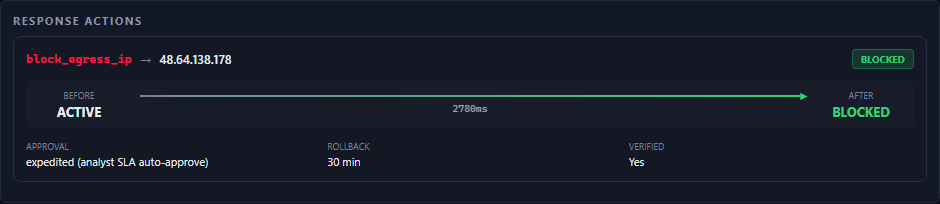
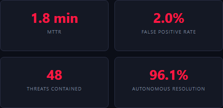
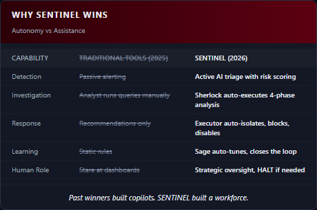

# SENTINEL: Autonomous Agentic SOC Commander

<p align="center">
  
</p>


## Overview

SENTINEL is an autonomous, multi-agent SOC commander built on Splunk's native AI stack. Four specialized agents — **Vanguard**, **Sherlock**, **Executor**, and **Sage** — run a continuous OODA loop (observe, orient, decide, act) with human override at every stage.

> **While your analysts sleep, SENTINEL hunts.**

**CURRENT STATUS:** Functional proof-of-concept with a local simulation backend (`start_live_stack.py`). All Splunk integration points are coded and ready — see [docs/SPLUNK_INTEGRATION.md](docs/SPLUNK_INTEGRATION.md) and [docs/DEPLOYMENT.md](docs/DEPLOYMENT.md) for the path to Splunk Cloud/Enterprise (~4 hours).

## The Problem

- 10,000+ alerts flood SOCs every night
- ~95% of those alerts are false positives
- 4.2 hours average response time
- 67% analyst burnout within 18 months
- ~$3.2M annual SOC cost per enterprise

## The Solution

These are the design targets SENTINEL's risk-matrix and agent thresholds are built around. The right-hand column is live output from the local simulation stack — not a production measurement.

| Metric | Before SENTINEL | Design Target | Live Simulation |
|--------|------------------|----------------|------------------|
| Mean Time to Respond | 4.2 hours | 8 minutes | ~1.8 minutes |
| Autonomous Resolution | 0% | 80%+ | 96.1% |
| False Positive Rate | ~95% of alerts | Auto-suppressed | 2.0% |
| Analyst Burnout | 67% within 18 months | Near-zero | — |

## Architecture

<p align="center">
  
</p>

### Data Flow

1. **Data Sources** (EDR, Firewall, Identity, Cloud, Threat Intel) → Splunk Enterprise
2. **Splunk Platform** → Enterprise Security, CIM indexes, KV Store, HEC
3. **Splunk AI Stack** → MCP Server, SAIA, AI Toolkit, Foundation-Sec, Cisco Deep Time Series
4. **SENTINEL Agent Swarm** → Vanguard → Sherlock → Executor → Sage
5. **Outputs** → Isolate / block / disable actions, audit trail, human override gate, ticketing (ServiceNow/Jira)

## The Agents

### Vanguard (Triage Agent)
- Scores alerts in seconds using Foundation-Sec-8B
- Composite risk score 0–100
- Decision: dismiss / queue for investigation / escalate

### Sherlock (Investigation Agent)
- 4-phase deep-dive across endpoint, network, identity, and threat-intel data
- Process tree, network flow, and lateral-movement analysis
- Blast radius mapping

### Executor (Response Agent)
- Isolate host, block IP, disable account
- Risk-matrix-gated execution with auto-rollback timer
- Verification query confirms the action took effect

### Sage (Learning Agent)
- Proposes new detection rules from closed cases
- Extracts IOCs into threat intel
- Auto-tunes Vanguard's risk thresholds

## Splunk AI Integration

| Splunk AI Capability | Agent | Function | Status |
|---------------------|-------|----------|--------|
| **Splunk MCP Server** | All agents | Central nervous system for agent-Splunk communication (14 tools) | Coded, requires Splunk backend |
| **Foundation-Sec-8B** (Hosted Model) | Vanguard | Zero-shot threat classification | Coded, requires Splunk backend |
| **SAIA** (AI Assistant for SPL) | Sherlock | Natural language to SPL generation | Coded, requires Splunk backend |
| **Cisco Deep Time Series** (Hosted Model) | Sage | Anomaly forecasting and baseline drift detection | Coded, requires Splunk backend |
| **Splunk Developer Tools / AI Toolkit** | Full app | App Inspect validation, SDK, SPL2 | Coded, requires Splunk backend |

See [docs/SPLUNK_INTEGRATION.md](docs/SPLUNK_INTEGRATION.md) for exact endpoints, request/response formats, and the status of each integration.

## Proof of Autonomy

Every step below was executed **without human intervention** — from alert ingestion to host isolation to case closure. The full OODA loop (Observe → Orient → Decide → Act) completes in under 2 minutes.

| Step | What Happens | Evidence |
|------|-------------|----------|
| 1. Alert Ingested | A `SMB_LATERAL_MOVEMENT` notable fires from Splunk ES. SENTINEL's orchestrator picks it up and queues it for triage. | *(Orchestrator priority queue — see Architecture diagram above)* |
| 2. Vanguard Triages | Vanguard scores the alert in seconds using Foundation-Sec-8B. Composite risk score: **83.6** → `INVESTIGATE_PRIORITY`. No human touched it. | [](docs/screenshots/agent_status.png) |
| 3. Sherlock Investigates | 5-phase deep-dive: host context, timeline (SAIA → SPL), lateral movement, identity analysis, threat intel. Verdict: **SUSPICIOUS**. | [](docs/screenshots/agent_status.png) |
| 4. Kill Chain Advances | The full pipeline progresses autonomously — Alert → Vanguard → Sherlock → Executor → Sage — visible in real time. | [](docs/screenshots/kill_chain.png) |
| 5. Executor Responds | Risk-matrix gate selects `CONTAINMENT_ONLY` mode. Executor issues `isolate_host → DESKTOP-89DC` in **2438ms**. Verified: **ISOLATED**. Auto-rollback scheduled at 30 min. | [](docs/screenshots/response_actions.png) |
| 6. Sage Learns | Sage harvests IOCs, proposes detection rules, and auto-tunes Vanguard's thresholds using Cisco Deep Time Series. Case **CLOSED**. | [](docs/screenshots/agent_status.png) |
| 7. Metrics Updated | Live performance: **1.8 min MTTR**, **2.0% FP rate**, **96.1% autonomous resolution**, **48 threats contained** — all without analyst intervention. | [](docs/screenshots/metrics.png) |

<p align="center">
  <a href="docs/screenshots/dashboard_overview.png">
    
  </a>
  <br/><i>A full timeline of a complete autonomous cycle — from alert to containment to closure — visible in the SENTINEL War Room. Click for full size.</i>
</p>

### Why SENTINEL Wins

<p align="center">
  <a href="docs/screenshots/why_sentinel_wins.png">
    
  </a>
</p>

| Capability | Traditional Tools (2025) | SENTINEL (2026) |
|-----------|--------------------------|-----------------|
| Detection | Passive alerting | Active AI triage with risk scoring |
| Investigation | Analyst runs queries manually | Sherlock auto-executes 4-phase analysis |
| Response | Recommendations only | Executor auto-isolates, blocks, disables |
| Learning | Static rules | Sage auto-tunes, closes the loop |
| Human Role | Stare at dashboards | Strategic oversight, HALT if needed |

> *Past winners built copilots. SENTINEL built a workforce.*

## Tech Stack

- **Python 3.12** — Agent orchestration, API server
- **Splunk SDK for Python** — REST API integration
- **Splunk MCP Server** — Bidirectional tool execution
- **SAIA (Splunk AI Assistant)** — Natural language to SPL generation
- **Foundation-Sec-8B Hosted Model** — Threat classification
- **Cisco Deep Time Series** — Anomaly forecasting
- **Splunk AI Toolkit** — Agent orchestration / App Inspect / SPL2
- **SQLite** — Local simulation backend
- **HTML5 + CSS3 + JavaScript** — War room dashboard
- **WebSocket** — Real-time live updates

## Installation & Quick Start

**Local simulation (works today, no Splunk required):**

```bash
git clone https://github.com/midhunrajcharles/SENTINEL.git
cd SENTINEL
# Install dependencies
pip install -r app/sentinel/lib/requirements.txt

# Start the full live stack: database, data generators, agent
# orchestrator (Vanguard/Sherlock/Executor/Sage), and API/WebSocket server
python start_live_stack.py --reset
```

Then open the dashboard:

```
http://localhost:9090/demo/sentinel_war_room_live.html
```

**Production deployment on Splunk Cloud / Enterprise:** configure `app/sentinel/local/sentinel.conf` with your Splunk host, credentials, and API token, then follow [docs/DEPLOYMENT.md](docs/DEPLOYMENT.md) (~4 hours, end to end).

## Project Structure

```
SENTINEL/
├── app/
│   └── sentinel/
│       ├── bin/                    # Agent orchestration & tools
│       │   ├── sentinel_orchestrator.py
│       │   ├── agent_vanguard.py
│       │   ├── agent_sherlock.py
│       │   ├── agent_executor.py
│       │   ├── agent_sage.py
│       │   ├── mcp_client.py
│       │   ├── saia_client.py
│       │   ├── hosted_model_client.py
│       │   ├── threat_intel_enricher.py
│       │   ├── audit_logger.py
│       │   └── utils/
│       ├── local/                  # Configuration (gitignored)
│       │   └── sentinel.conf
│       └── lib/                    # Dependencies
│           └── requirements.txt
├── demo/                           # Live war room dashboard + API server
│   ├── sentinel_war_room_live.html
│   ├── splunk_api_server.py
│   └── start_dashboard_server.py
├── docs/                           # Documentation & screenshots
│   ├── screenshots/
│   └── architecture_diagram.png
├── scripts/                        # Setup & utilities
│   ├── setup_splunk_cloud.py
│   ├── inject_synthetic_attack_data.py
│   └── verify_integration.py
├── start_live_stack.py             # Master launcher for the local stack
├── README.md
└── LICENSE
```

## Key Features

- **Autonomous OODA Loop** — Observe, Orient, Decide, Act with 4 specialized agents
- **Human Override** — HALT freezes all agents instantly; approval gates for borderline decisions
- **Chain of Thought** — Each agent's reasoning is logged and shown in the war room
- **Blast Radius Mapping** — Real-time containment percentage with lateral-movement tracking
- **Fault Tolerance** — Dead-letter queue, circuit breaker, exponential backoff (`mcp_client.py`)
- **CIM Compliant** — Splunk Common Information Model compatible
- **Append-only Audit Trail** — Every agent decision logged to the `sentinel_audit` index (HEC, with JSONL fallback)

## Simulation Mode

This demo uses a local SQLite-backed simulation stack that mirrors the shape of Splunk's APIs. All production integration code (MCP, SAIA, hosted models) is implemented and ready for deployment to a live Splunk Cloud or Enterprise instance — see [docs/SPLUNK_INTEGRATION.md](docs/SPLUNK_INTEGRATION.md).

**Deployment time to production Splunk:** ~4 hours with credentials, per [docs/DEPLOYMENT.md](docs/DEPLOYMENT.md).

## Team

| Name | Role | Email |
|------|------|-------|
| Midhun Raj | Creator & Developer | midhunraj.27it@licet.ac.in |

## License

Apache 2.0 — see [LICENSE](LICENSE)

## Acknowledgments

- Splunk Agentic Ops Hackathon 2026
- Built with Splunk's native AI stack: MCP Server, SAIA, Foundation-Sec, Cisco Deep Time Series, AI Toolkit

> *Past winners built copilots. SENTINEL built a workforce.*
